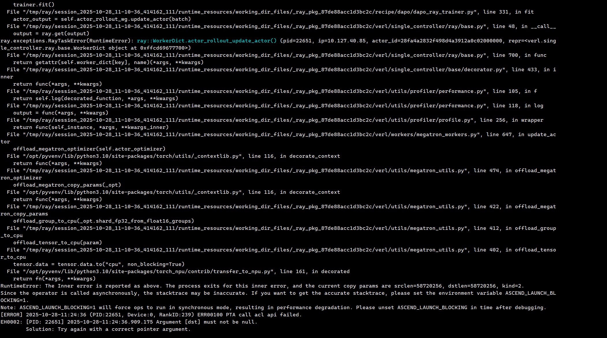
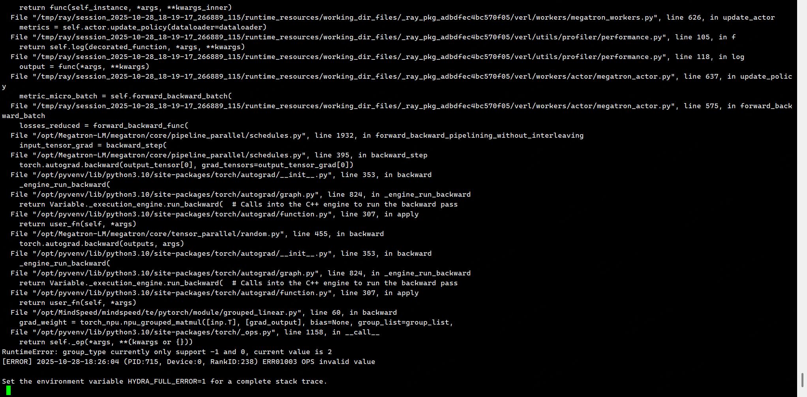

## 参数报错记录表

   +actor_rollout_ref.actor.optim.override_optimizer_config.optimizer_cpu_offload=True\

这个参数NPU用不了



## MLA 适配部分

### group_type currently only support -1 and 0, current value is 2



## 替换对应的包

在 `start.sh`里面添加代码


比如你在 `/data01/huawei-2025/tmp/vllm-ascend-0110/` 放了一个新的vllm-ascend的代码，然后想要替换掉原来的`vllm-ascend`的包，那么在`start.sh`里面添加一段执行代码，这样执行

```bash

rm -rf /opt/vllm-ascend
cp -rf /data01/huawei-2025/tmp/vllm-ascend-0110 /opt/vllm-ascend

```


## 适配MLA

适配MLA就是要换一个新的MindSpeed上去，

示例脚本：

`k8s/patch/apply_mindspeed.sh`

### 适配逻辑

1. 在 `/home/code/verl-gpu/tmp/MindSpeed` 下放了一个新的MindSpeed代码，切换到 `origin/2.2.0_core_r0.12.1` 然后想要替换掉原来的MindSpeed的包

2. 在`start.sh`里面添加一段执行代码，替换掉掉原来镜像里的`/opt/MindSpeed`的MindSpeed的包

3. 还有一个代码要回退，`\cp k8s/patch/mindspeed.patch/2.2.0_core_r0.12.1/MindSpeed/mindspeed/te/pytorch/module/grouped_linear.py /opt/MindSpeed/mindspeed/te/pytorch/module/grouped_linear.py`


## 开启确定性计算

代码已经加入到 verl/workers/megatron_workers.py 中


替换了 set_random_seed() 函数的实现
```python

import random
import numpy as np
import torch
import torch_npu

def set_random_seed(seed):
    import random

    import numpy as np
    import torch

    torch.manual_seed(seed)
    np.random.seed(seed)
    random.seed(seed)
    if get_torch_device().device_count() > 0:
        from megatron.core import tensor_parallel

        tensor_parallel.model_parallel_cuda_manual_seed(seed)
    # FIXME: torch cumsum not support deterministic (used in vllm sampler),
    # https://github.com/pytorch/pytorch/issues/89492
    # torch.use_deterministic_algorithms(True, warn_only=True)
    # os.environ['CUBLAS_WORKSPACE_CONFIG'] = ':4096:8'
    if os.getenv("USE_SEED","0") == "1":
        random.seed(seed)
        os.environ['PYTHONHASHSEED'] = str(seed)
        os.environ['HCCL_DETERMINISTIC'] = str(True)
        os.environ['LCCL_DETERMINISTIC'] = str(1)
        os.environ['CLOSE_MATMUL_K_SHIFT'] = str(1)
        os.environ['ATB_LLM_LCOC_ENABLE'] = "0"
        np.random.seed(seed)
        torch.manual_seed(seed)
        torch.use_deterministic_algorithms(True)

        torch_npu.npu.manual_seed_all(seed)
        torch_npu.npu.manual_seed(seed)

```


经过这个修改，配置文件中的种子不再适用，环境变量 `USE_SEED` 设置了 (不要设置成0) ，则启用deterministic计算


